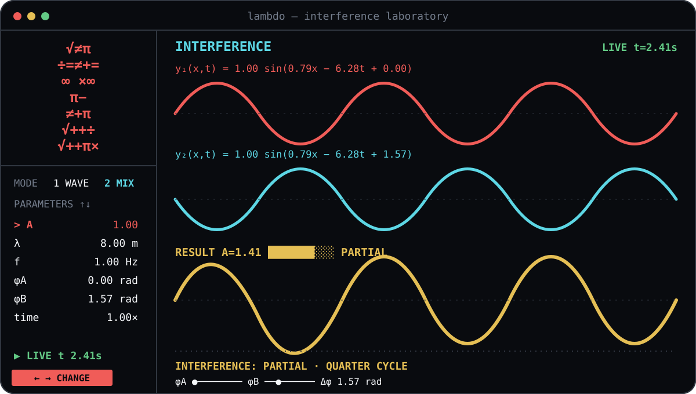

<div align="center">
  
  <p><strong>Change the equation and watch the wave respond.</strong></p>
  <p><a href="./README.pt-BR.md">Leia em português</a></p>
</div>

<p align="center">
  
</p>

Lambdo began with a page from my physics notebook. I was studying wavelength, frequency and interference, and I wanted to see the symbols move instead of memorising an equation without an image.

This project connects wave physics with a program that can be changed and measured. Lambdo runs in the terminal and calculates every displayed point from the current wave parameters.

## From the equation to the screen

For a travelling wave, Lambdo uses:

```text
y(x,t) = A sin(kx - ωt + φ)
```

The values shown by the interface come from these relations:

| Quantity | Relation | What changes on screen |
|---|---|---|
| Amplitude | `A` | Height of the wave |
| Speed | `v = λf` | Distance travelled per second |
| Wave number | `k = 2π/λ` | Spatial repetition |
| Angular frequency | `ω = 2πf` | Oscillation rate |
| Period | `T = 1/f` | Time for one cycle |
| Superposition | `y = y₁ + y₂` | Result of two simultaneous waves |

Changing `λ`, `f`, `A` or `φ` updates the trace and the derived values. There is no prerecorded animation.

## Interference as a measurable result

Two waves with amplitude 1 produce different resultant amplitudes when only their phase difference changes:

| Situation | Phase difference | Resultant amplitude | Percentage of maximum |
|---|---:|---:|---:|
| In phase | `0.00 rad` | `2.00` | `100%` |
| Quarter cycle | `1.57 rad` | `1.41` | `71%` |
| Opposite phase | `3.14 rad` | `0.00` | `0%` |

For equal amplitudes, the analytical result is:

```text
Aresult = 2A |cos(Δφ / 2)|
```

The program classifies the result as constructive, partial or destructive and also displays the phase difference, an intensity bar and the current equations.

```bash
npm run compare
node dist/cli.js --compare --json
```

## Open the laboratory

Lambdo needs Node.js 22 or newer and works best in a terminal with at least 80 columns and 24 rows.

```bash
git clone https://github.com/miguelconfuso/lambdo.git
cd lambdo
npm ci
npm run build
npm start
```

To make `lambdo` available as a command on the same computer:

```bash
npm install -g .
lambdo
```

You can also print a deterministic frame without opening the interactive interface:

```bash
node dist/cli.js --snapshot --wavelength 8 --frequency 2
node dist/cli.js --snapshot --mode interference
```

## Controls

| Key | Action |
|---|---|
| `Up`, `Down` | Select a parameter |
| `Left`, `Right` | Change its value |
| `Space` | Pause or continue time |
| `M` or `Tab` | Switch between travelling wave and interference |
| `1`, `2` | Open a mode directly |
| `P` | Put Wave B in phase or opposite phase |
| `H` | Explain the current state and show formulas |
| `R` | Restore the initial values |
| `Q` | Quit |

## Implementation choices

The project has no runtime package dependencies. `src/physics/wave.ts` validates the parameters and contains the analytical calculations. `src/rendering/wave.ts` converts sampled points into a Unicode trace. `src/terminal.ts` controls input, layout and ANSI output.

The first version became slow because it created too much terminal output. I replaced the interface framework with a direct renderer, limited the animation rate and started updating only the rows that changed. The renderer also waits when the output stream applies backpressure, so frames do not accumulate in memory.

The physics and rendering modules are independent from the live terminal. This lets tests verify the equations, phase wrapping, superposition and trace continuity without depending on animation timing.

## What I learned

Lambdo taught me that a simulation needs two kinds of correctness. The calculation must follow the mathematical model, and the drawing must communicate that result without creating a false impression. Low frequencies, small amplitudes and complete cancellation were important cases because they forced me to improve the scale and visibility of the line.

I also learned to investigate performance instead of only adding more memory. The useful fix was reducing how much work each frame produced.

Run the checks with:

```bash
npm test
npm run typecheck
npm run build
```

I would like to continue the project with reflection, standing waves, nodes and antinodes. Lambdo is available under the [MIT license](LICENSE).
